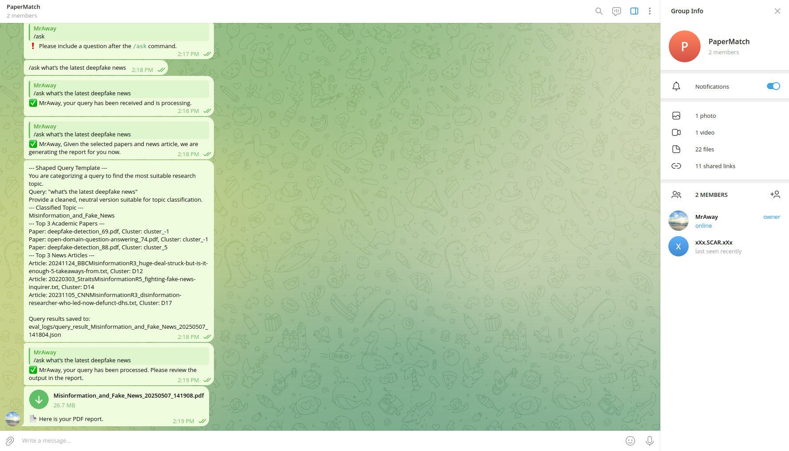
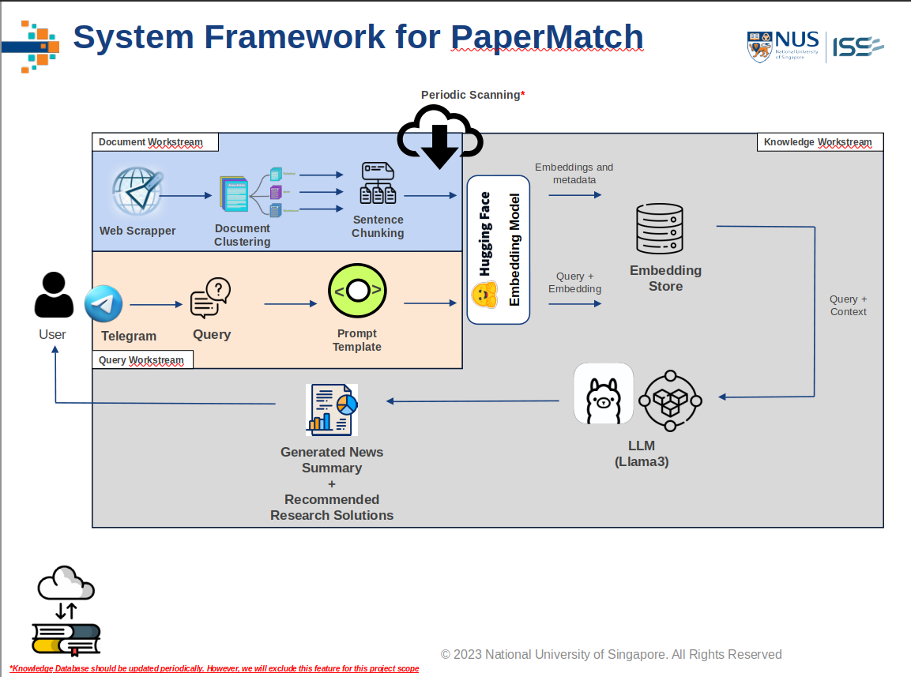

# 📘 PaperMatch: AI-Enhanced Insights for Academic & Media Discovery via Telegram API



## 🚀 Executive Summary

PaperMatch is an AI-driven platform designed to streamline the process of discovering academic research and interpreting media narratives around key topics.

With the exponential rise in scholarly publications and fragmented media coverage, researchers face information overload and lack tools that connect academic rigor with real-world discourse. PaperMatch bridges that gap by offering:

* 🧠 Summarization of academic papers using LLMs (Llama3 via Ollama)
* 🌍 News analysis and clustering by topic
* 🤖 A single interface (via Telegram) to query and receive structured reports

Backed by insights from academic research on information behavior and media framing (e.g., Bawden & Robinson, 2009; Tenopir et al., 2012; Entman, 1993), PaperMatch offers both relevance and context in one unified platform.

---

## 🧑‍💻 Project Credits

| Name                | Student ID | Contributions                                                                                                |
| ------------------- | ---------- | ------------------------------------------------------------------------------------------------------------ |
| Alvin Wong Ann Ying | A0266486M  | Project lead, academic scraping, graph/embedding pipeline, LLM summarization, Telegram API, code integration |
| Bertrand Tan        | A0292314J  | News scraping, clustering for media content, evaluation framework                                            |

---

## 🏗️ System Architecture & Demo



🎥 [Watch the Demo](https://youtu.be/Pukb5Xa0ToQ)

---

## 📘 User Guide

See Appendix 7.4 in the Project Report on GitHub for the full installation guide.

🛠️ Supported OS: Ubuntu 20.04 / 22.04

---

### 🔧 1. Prerequisites

Install Ollama and pull the Llama3 model:

```bash
git clone https://github.com/MRAWAY77/PaperMatch.git
cd PaperMatch/query/
ollama pull llama3
```

---

### 📦 2. Local Installation

Set up the environment:

```bash
conda create -n papermatch python=3.10.16 -y
conda activate papermatch
pip install -r requirements.txt
```

Next, download and extract the required folders into the project root directory:

📁 Download from Google Drive
🔗 [https://drive.google.com/drive/folders/1dBYjVw8gvEo9h2YO9v3y-TY6y9i8uvvH?usp=drive\_link](https://drive.google.com/drive/folders/1dBYjVw8gvEo9h2YO9v3y-TY6y9i8uvvH?usp=drive_link)

Download and unzip:

* datasets.zip
* cluster\_embeddings.zip

Make sure the extracted folders are placed according to the directory structure shown in Section 3.

---

### 📁 3. Project Directory Structure

The directory tree should look like this:

```
papermatch/
├── academic_papers.csv
├── assets/
│   ├── architecture.png
│   ├── MDDI_blend.jpg
│   ├── MDDI.jpg
│   ├── sample_report.pdf
│   └── telegram.png
├── datasets/
│   ├── Academic_Clusters/
│   ├── News_Clusters/
│   └── academic_metadata.csv
├── graph_network/
│   ├── cluster_embeddings/
│   ├── graph_network.py
│   ├── cluster_embeddings.py
│   ├── output_graphs/
│   └── sim_score_graph_network.txt
├── query/
│   ├── config.py
│   ├── llm.py
│   ├── query.py
│   ├── main.py
│   ├── eval_logs/
│   └── ...
├── scrapers/
│   ├── paperwithcode_chrome.py
│   └── paperwithcode_firefox.py
├── utils/
│   ├── categorise_papers.py
│   ├── helper.ipynb
│   ├── sorting.py
│   ├── topic_modeling.py
│   └── topic_model_results/
├── LICENSE
├── README.md
├── requirements.txt
└── setup.sh
```

---

### 📲 4. Telegram API Configuration

To connect PaperMatch to a Telegram group:

1. Visit [https://my.telegram.org](https://my.telegram.org) and create an app.
2. Retrieve your api\_id and api\_hash.
3. Create a group chat and copy the group link.

Update query/config.py:

```python
api_id = <insert your api_id>
api_hash = '<insert your api_hash>'
phone_number = '<insert your phone number>'
TARGET_CHANNEL = '<insert telegram group link>'
```

---

### ▶️ 5. Running the App

Start the Telegram-integrated query interface:

```bash
python query/main.py
```

Once the script is running and connected to your Telegram group, interact with the bot using the following command:

📩  Send this in your Telegram group:

/ask \[your query here]

This command triggers the AI pipeline, which retrieves relevant academic papers, summarizes them, matches media coverage, and generates a contextualized PDF report directly in your Telegram chat.

Example:

/ask What are the latest Deepfake trends?

This will generate an AI-enhanced academic-media insight report based on your query.

---

### 📄 6. Sample Output Report

Example report generated by the system:


---

## 📚 Project Report

See the full project report in the GitHub folder: Project\_Report

---

## 🙋 Support Personnel

For any issues or inquiries, please contact the support personnel listed below:

| Name           | Role                   | Contact Email                 |
|----------------|------------------------|-------------------------------|
| Alvin Wong     | Team Lead/AI & SW Eng  | <alvinwongannying@gmail.com>  |
| Bertrand Tan   | Member/AI Eng          | <bertrand.tanyj@gmail.com>    |

---
